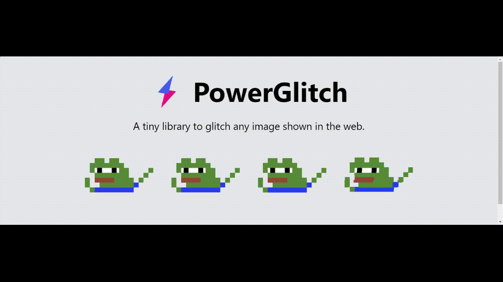

PowerGlitch is a standalone library with no external dependencies. It leverages CSS animations to create a glitch effect on any image. No canvas drawing or DOM manipulations are needed to create the glitch effect.

For more info, check the [demo](https://7ph.github.io/powerglitch/#/playground) or check out the [documentation](https://7ph.github.io/powerglitch/)

