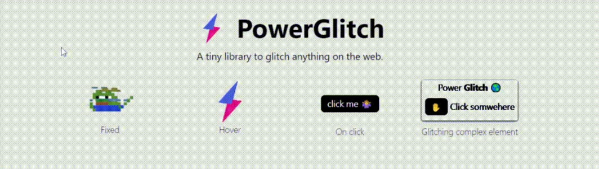

PowerGlitch is a standalone library with no external dependencies. It leverages CSS animations to glitch anything on the web, without using a canvas. It weights less than 2kb minified and gzipped.<br>

Want to try it out? Check out the [demo](https://7ph.github.io/powerglitch/#/playground) 😊

<p align="right">
    Like this project? Give a star 🌟
</p>

## Getting started

1. Install PowerGlitch using a package manager
    ```bash
    npm i --save powerglitch
    # or
    yarn add powerglitch
    ```
    or by [importing the web bundle](https://unpkg.com/powerglitch@latest/dist/powerglitch.min.js) in a script tag (or save it locally)
    ```html
    <script src="https://unpkg.com/powerglitch@latest/dist/powerglitch.min.js"></script>
    ```

2. Find an element to glitch
    ```html
    <!-- Image -->
    

    <!-- Button -->
    <button class='glitch'>
        click me 🤷‍♂️
    </button>

    <!-- Any DOM element -->
    <div class='glitch'>
        <p>Hello <b>World</b></p>
    </div>
    ```

3. Import PowerGlitch using ES6 import
    ```javascript
    import { PowerGlitch } from 'powerglitch'
    ```
    or using ES5 require
    ```javascript
    const PowerGlitch = require('powerglitch').PowerGlitch
    ```
    if you are importing PowerGlitch using a `script` tag, the `PowerGlitch` global variable is automatically available.

4. Glitch the element
    ```javascript
    PowerGlitch.glitch('.glitch')
    ```

5. That's it, your element is glitched!
6. Check-out the [usage guide](https://7ph.github.io/powerglitch/#/usage) for optimization and usage tips.

## Useful links

Documentation
- Visually try out effects using the [demo](https://7ph.github.io/powerglitch/#/playground).
- Lookup PowerGlitch [home page](https://7ph.github.io/powerglitch/).
- For customization and optimization tips, check the [usage guide](https://7ph.github.io/powerglitch/#/usage).
- Check out the [api documentation](https://7ph.github.io/powerglitch/api-docs/variables/PowerGlitch.html) for reference.

Integrations
- React: [react-powerglitch](https://github.com/7PH/react-powerglitch)
- Vue: [vue-powerglitch](https://github.com/7PH/vue-powerglitch)

## Contributing

Having trouble? Found a bug? Want to contribute? Any kind of contribution is welcome. If you have any questions, please open an issue or create a pull request.
